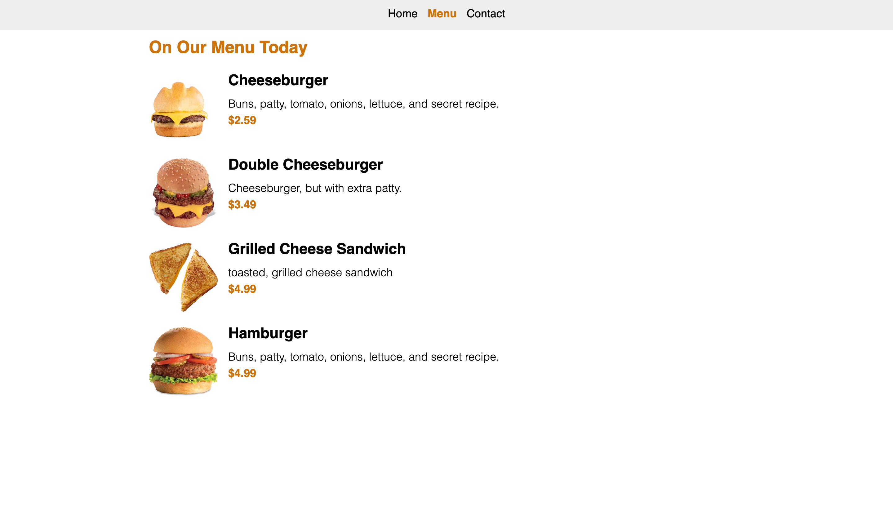

## Restaurant Page

This repo contains a simple restaurant web application. The goal is to render the page's components dynamically using javascript.

## Built With

- HTML
- CSS
- JS
- Webpack

## Getting Started

* Clone this repo
`git clone git@github.com:cyonii/restaurant-page.git`

#### Without Node.js
* open project directory.
* open `dist` directory.
* open `index.html` file in your faourite browser.

#### With Node.js
* cd into project directory.
* run the `npm install`
* run `npm run serve` to start the start application.
* visit `http://localhost:8080` in your browser.

## Authors
👤 **CY Kalu**
- GitHub: [@sinansevgi](https://github.com/cyonii)
- LinkedIn: [@sinansevgi](https://www.linkedin.com/in/cyonii/)
- Twitter: [@nativeofcybers1](https://twitter.com/cy_kalu)
- Portfolio: [Website](https://cykalu.me)

## Contributing

Contributions, issues, and feature requests are welcome!

Feel free to check the [issues page](https://github.com/sinansevgi/Restaurant_Page/issues).

## Acknowledgements

- [**Project Description**](https://www.theodinproject.com/courses/javascript/lessons/restaurant-page)

## Show your support

Give a ⭐️ if you like this project!

## 📝 License

This project is [MIT](LICENSE) licensed.
